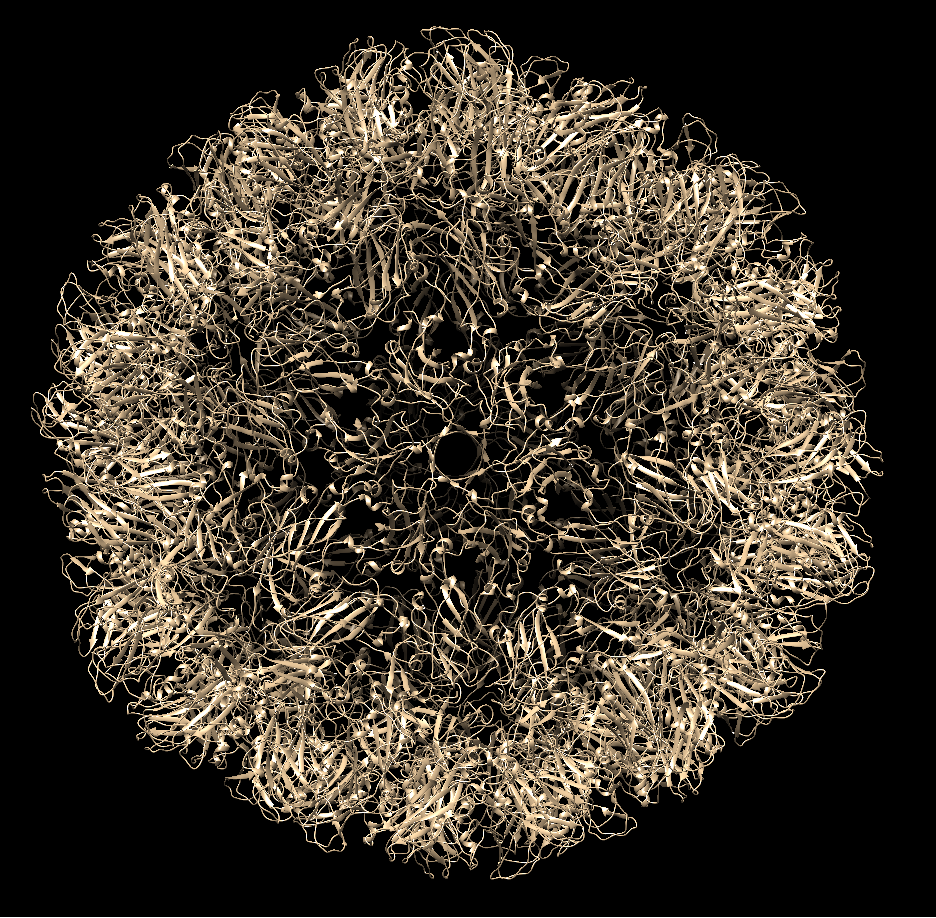

# Macrocomplex builder
*Guillermo Palou Márquez and Javier Sánchez Utgés*

## **TABLE OF CONTENTS**

<!-- TOC depthFrom:1 depthTo:6 withLinks:1 updateOnSave:1 orderedList:0 -->
- [Description](#description)
- [SBI-Python project](#sbi-python-project)
- [Installation](#installation)
  - [via Git](#1-via-git)
  - [via Setup](#2-via-setup)
  - [via Pip](#3-via-pip)
- [Requirements](#requirements)
- [Information](#information)
  - [Input files](#input-files)
  - [Limitations](#limitations)
- [Biological background](#biological-background)
- [Algorithm](#algorithm)
- [Tutorial](#tutorial)
  - [Command-line arguments](#command-line-arguments)
  - [Example 1](#example-1-6ezm)
  - [Example 2](#example-2-1g65)
  - [Example 3](#example-3-5vox)
  - [Example 4](#example-4-5oom)
  - [Example 5](#example-5-3kuy)
  - [Example 6](#example-6-virus-capsids)
<!-- /TOC -->

## Description
This program is able to reconstruct biological macrocomplexes of protein-protein interactions as well as protein-DNA/RNA interactions given a set of binary interactions and the desired number of chains of the target complex.

## SBI-Python project

## Installation

### **1) via Git**

The package can be downloaded using Git:

 ```bash
  git clone https://github.com/gpalou4/macrocomplex_builder
  cd macrocomplex_builder
 ```

### **2) via Setup**

### **3) via Pip**

## Requirements

The following versions of packages/modules must be installed in order to run our program properly:

- Python v3.6.7
  - Sys
  - Os
  - Timeit
- Biopython v1.73
- Argparse v1.1
- Logging v0.5.1.2
- Re v2.2.1

## Information
### Input files

The input files consist of pairs of interactions (protein-protein or RNA/DNA-protein) in PDB format. All of them must be provided in the same input directory and it is not necessary to provide at least one chain of each type.

### Limitations

- The program scales badly as a consequence of the exponential increase of the total comparisons that it has to make. However, for the most examples it takes less than 30 seconds. 
- The stoichiometry is not requested. Instead, the program relies on the number of chains of the target complex given by the user.
- The two chains that are superimposed must be identical (same number of atoms and residues).
- No GIU interface developed yet.
- The maximum number of chains the target complex can have is 738.
- Open complexes...

## Biological background

The extended use of experimental techniques such as x-ray crystallography and nuclear magnetic resonance (NMR) spectroscopy has led to the determination of a lot of individual protein structures, or their domains, successfully. Although this information is very valuable, increasing evidence suggests that proteins do not work as individual entities but in complex with other macromolecules. Some examples are the nucleosome, the spliceosome, the proteasome and the ribosome.
As a consequence, the focus of modern structural genomics has shifted towards the study of macromolecular complexes (Petoukhov MV 2005 et al.) However, the assembly and study of these macromolecular complexes is very hard by the conventional methods due to their large size and structural flexibility. Since in many cases, the structures of individual subunits and/or interactions among them are available, in silico models can be built to predict the complete macromolecular structure.

Our approach is based in the use of superimpositions between the subunit chains. A superimposition is the procedure by which two molecule structures (two proteins, two DNA/RNA molecules, etc) are placed in space minimizing the distance between the backbone atoms of both structures. Similarly to sequence alignments, where equivalent residues are those that fill the same position in the alignment according to a sequence similarity criteria, in structural alignments equivalent residues are those that are the closest in space. To do so, a Translation and Rotation matrix is calculated for one structure (sample), and it is applied so that it fits the coordinates of the other structure (reference). Once two molecules are superimposed we need to quantify how different the two structures are. The typical measurement is the Root-Mean-Square Deviation (RMSD). It is a measurement of the average distance between two sets of atoms (usually the backbone atoms) of the superimposed molecules. Below a value of 3, both structures are considered the same. 

|  |

Where V and W are the molecules that will be compared, n is the number of atom pairs that will be compared (Vix, Viy, Viz) are the coordinates of one atom of V and (Wix, Wiy, Wiz) are the coordinates from one atom of W superposed with V using a linear application of rotation and translation. To compute the RMSD between molecules V and W we will use the coordinates of the backbone atoms of residues as close as possible in space after superposition.

After the superimposition is done, and have a reasonable RMSD, we are interested in the chains of the sample structure that actually have not been superimposed, as we are trying to build a multi-chain complex. Because of the superimposition, the atoms coordinates of these non-superimposed chains have changed, thus, they have rotated towards the reference structure. To accept this new rotation, we must check whether the atoms of these chains clashes with the atoms of any of the chains of the reference structure. Clashes are unfavorable interactions where atoms are too close together. They can be calculated as how many atoms have at least one atom within radius of center. In a real protein, this cannot happen, because if the distance between two atoms is minimum, the energy is maximum. For instance, repulsive forces prevail in Van Der Waals interactions, due to the collision of external electron clouds, making this interaction unfavorable. If the number of clashes is below a given threshold, we can allow this new rotation and add the chain in the reference structure.

Example: 

Having two binary protein interactions (reference: A-B, sample: C-D), we make the superimpositions of the sample chains to the reference chains (4 in total: C/A, C/B, D/A, D/B). Then, two chains are superimposed (one reference chain with one sample chain), while the other sample chain is displaced in space along with its superimposed partner chain. We start with the one with the lowest RMSD (and below a given threshold), for instance, the superimposition between A/C --> B-A/C-D. We assume then, that A and C chains are the same, and that the interaction with D (the non-superimposed chain) is now placed correctly. To confirm this, we also need to check the clashes between the non-superimposed chain (D) and the rest of chains of the reference structure (2 reference chains in this case). If there are too much clashes, that means that the putative chain to add is not placed correctly which means that this superimposition, although it has a good RMSD score, must be rejected. After skipping this superimposition, we look for the next best RMSD score, and look for clashes again, and so on and so forth. On the other hand, if the number of clashes is admisible, the final structure will be B-A/C-D. We can keep doing the same strategy with the next binary interaction. But now, having 3 chains in the complex, there will be more superimpositions and more comparisons to make.

|  |

## Algorithm

This is a program that given a set of binary protein-protein or RNA/DNA-protein interactions, builds a macro-molecular complex by means of a recursive function. The algorithm of the program is quite straightforward and is the following.
The input that is going to be passed onto the program consists of two **required** arguments: the input directory, `-i`, containing all the binary interaction PDB files which are going to be used to build the complex and the wanted number of chains for the target complex, i.e., the number of chains that the user wants the final complex to have. There are other arguments that allow the user to customize a bit the program execution by changing some of the parameters that the program needs to run. These are `-rmsd` and `-cl`  which are the RMSD and clashes thresholds. It also has the `-pi` flag that if present, will make the program save a PDB/MMCIF every time a chain is added to the complex and the `-v` flag that prints the progression log in the command line if present.

Once the program is executed, the recursive function will loop iteratively through the list of files present in the input directory and in each iteration, it will add a chain,if possible, resulting from the best superimposition of one of the two chains in the new file against one of the chains of the reference structure, which is the building complex. The program will finish running once the number of chains of the complex equals the one specified by the user in the `-nc` argument, or if this is not the case, after all the files have been processed once without adding any new chains to the complex.

Every time the function is called it needs certain parameters in order for it to work, they are the following:
* A reference structure, `ref_structure`, which is the building-complex structure, the first PDB file on the first iteration. Its number of chains keeps increasing as iterations take place.
* A list containing all the input files, `files_list`. It does not change during the whole running time.
* An integer to keep track of the iteration the recursive is currently in, `it`.
* An integer to keep track of the files that have been processed and no chains have been added afer having processed it, `not_added`.
* An `ArgumentParser` instance containing all the arguments, optional and required that are needed to run the program. This instance, `command_arguments` will contain the following arguments:
	* The input directory, `indir`.
	* The output directory, `outdir`.
	* An RMSD threshold, `RMSD_threshold`, that will set the limit for superimpositions to be taken as correct. It does not change during the whole running time.
	* A clashes threshold, `clashes_threshold`, that will be the maximum number of clashes that a chain can have with a reference structure in order to be considered as not present in the complex. It does not change during the whole running time.
	* The number of chains that the complex must eventually have, `nc`.
	* A boolean, `False` by default, `pdb_iterations`, that indicates whether the user wants to save a PDB file every time a chain is added to the complex.
  
In each iteration a file is going to be processed. First, a structure instance is going to be created from the file. Then, the `Superimposition` function is going to be called with a reference and a sample structure as parameters. This function does all the possible superimpositions between the two chains from the sample structure and all the chains from the reference one, only if the number of _CA_, for proteins, or _C4’_, for nucleic acids, atoms, obtained with the `Key_atom_retriever` function, is the same in both chains, and also if they are the same kind of molecule, i.e., DNA, RNA or PROTEIN. It returns a list of key, value tuples with a tuple of the reference and sample chains identifiers as key and the Superimposer instance of those two chains as value, which is sorted by the RMSD of the value, as well as a boolean that informs of whether a common chain between the reference and the sample structure has been found and the RMSD of the best superimposition.

If the boolean is false, i.e., no common chain between reference and sample structure has been found, or the smallest RMSD is greater than the threshold, the currently processed file is popped from the list and appended to the end of it, this way, it will be processed in a future iteration, 1 is added to the iteration and files that add no chains counters and the function is called again.

However, if there is a common chain and its RMSD with a given reference chain is less than the threshold, the program loops through the sorted list of key-value tuples with Superimposer objects as values. If its RMSD is greater than the threshold, the loop will continue, going to the next entry of the sorted list of tuples. On the other hand, if the RMSD is below the threshold, the translation and rotation matrices of the Superimposer instance are applied to the key atoms, CA for proteins or C4’ for nucleic acids, of the putative chain to add, which is the one that is not the common chain with the reference structure, and with these new coordinates, the presence of clashes between the new coordinates of the putative chain to add atoms and the reference structure is checked. If the number of clashes is under the threshold, it keeps checking for the rest of reference chains. If none of the combinations of reference chains and putative chain to add has more clashes than the threshold, i.e., at the end of the loop of the refeerence chains, the program determines that the putative chain to add is not present in the complex and does not clash with any of the other chains already present in the complex, and therefore it is right to add it. The function `ID_creator` will generate a new ID for that chain that will not have any of the chains already present in the complex. When the chain is successfully added to the reference structure, the program might generate a PDB/MMCIF file that will contain the complex build so far, depending on the value of the `--pdb_iterations` argument, the file is popped and appended at the end of the list, the counter of iterations increases by one, the one of files that have not added chains goes back to 0 and the recursive function is called again.

On the contrary, it only takes one combination exceeding the threshold of clashes to cancel the addition of that rotated chain, for it will mean that it is already in the complex or collides with a given chain, and as a consequence, cannot be added to the complex. When this last scenario takes place, a boolean is generated and takes the value of `True`. This indicates that the chain is already present in the complex. The loop of reference chains will be broken and the next superimposition in the list of tuples will be examined. If none of the superimpositions yield a chain to add, the loop will arrive to its end and then the processed file is popped and appended at the end of the list, the iteration and the files that do not add a new chain to the complex counters increase by one and the function calls itself again.

The function will end when the number of chains is reached or if that is not the case, when all the files have been processed once without adding any new chains to the complex, for it will mean that no chains can possibly be added to the complex. With this approach, even if the user did not know how many chains the target complex has, could use a very big number of chains, e.g., 100, and this way, the complete complex would be built and after all the files have been processed once without adding any chains, the program would finish running. 

The following figure is a basic flowchart of the algorithm that the program uses, showing all the basic conditions, loops and outcomes.

In this flowchart, the green ellipse corresponds to the calling of the iterative function. The yellow rhmobus are conditions, blue rectangles statements and orange ellipses are loops. The conditions yield either `True` or `False` and depending on it different outcomes will take place. In this figure, it is also represented what happens when the loops end.

#### Key
* chains: number of chains of the complex in this iteration.
* nc: number of chains of the final complex provided by the user.
* n: number of files that have been processed without adding any new chains to the complex.
* files: number of files on the input directory.
* chain in ref: loops through all chains in the reference structure.
* chian in sample: loops through all chains in the sample structure.
* sample_mol: molecular type of the sample chain, either RNA, DNA or PROTEIN.
* ref_mol: molecular type of the reference chain.
* sample_atoms: length of the list containing all the key atoms of the sampla chain.
* ref_atoms: length of the list containing all the key atoms of the reference chain.
* Common chain: boolean informing of whether a common chain has been found between the new file and the reference structure.
* k, v in RMSDs: loops through the list of key, value tuples, having a tuple of reference chain ID and sample chain ID as key and a Superimposer instance as value.
* RMSD: smallest RMSD of all the superimpositions carried out between sample and reference chains.
* threshold<sub>1</sub>: RMSD threshold above which superimpositions will be discarded.
* clashes: number of clashes between the putative chain to add and a reference chain.
* threshold<sub>2</sub>: clashes threshold above which putative chains will be discarded.
* Present chain: boolean informing of whether the putative chain to add is already found in the complex.


## Tutorial

### **Command-line arguments**

  - `-h`, `--help`: this flag will show the usage of the program as well as a description of what it does as well as an explanation of all the parameters it has and can modify or offer some information when executing the program.
  - `-i`, `--indir`: this argument is **required** can either be an absolute or relative path of the input folder containing all the binary-interaction PDB files that are going to be used to build the complex.
  - `-o`, `--outdir`: this argument is **optional** and if set, all the output files will be saved in this folder. If not set, by default, the output files will be saved in a folder named: _input_foldername_output_.
  - `-v`, `--verbose`: this argument is **optional** and will print the progression log in the standard error if set.
  - `-pi`, `--pdb_iterations`: this argument is **optional** and will save a new PDB file every time a chain is added to the complex if set.
  - `-nc`, `--number_chains`: this argument is **required** and indicates the number of chains that the final complex must have.
  - `-rmsd`, `--rmsd_threshold`: this argument is **optional** and if set, the RMSD threshold will take its value. If not, it will take a value of 0.3 by default.
  - `-cl`, `--clashes_theshold`: this argument is **optional** and if set, the clashes threshold will take its value. If not, it will take a value of 30 by default.

## Examples

Here, we show you the commands necessary to run the script and build the following complexes by using the folders in the `examples` directory. Also, the output files that the script generates from these examples can be found in the `examples_output` folder. There is also a small explanation of the complexes, and a brief analysis of the time it takes ths script to run the example and the quality of the complex it builds.

### Example 1, 6EZM

The first example is the Imidazoleglycerol-phosphate dehydratase from Saccharomyces cerevisiae. It is a Homo 24-mer (stoichiometry: A24). Based on the input provided files, the following command will recover the complete complex:

```bash
python3 macrocomplex_builder.py -i 6ezm -nc 24
```
 Where:
 
 -6ezm: is the input folder containing all the binary-interaction PDB files
 
 -24: indicates that the final complex must have 24 chains
 
 The computation time is around 2-5 seconds, and the RMSD between the reconstructed complex and the original PDB file is 0.639 Â. The input folder contains 23 files and 24 chains. In this particular example, there is always a common chain (chain A) between any two binary interactions. For that reason, in each iteration occurs a superimposition between both equal chains A with an RMSD of 0, giving a total of 24 iterations and 24 chains.
 
|  |  |  |
| :---: | :---: | :---: |
| *Original* | *Built* | *Superimposition*|

### Example 2, 1G65
  
The second example corresponds to the 20S proteosome from Saccharomyces cerevisiae. It is a Hetero 28-mer (stoichiometry: A2B2C2D2E2F2G2H2I2J2K2L2M2N2). Based on the input provided files, the following command will recover the complete complex:

```bash
python3 macrocomplex_builder.py -i 1g65 -nc 28 -rmsd 0.5 -cl 45 
```
 Where:
 
 -The new RMSD threshold (default is 0.3) is 0.5
 
 -The new clashes threshold (default is 30) is 45
 
The computation time is around 10-15 seconds and the RMSD between the reconstructed complex and the original PDB file is 0.975 Â. In this example, we must change the RMSD and clashes thresholds because it can only recover 27 chains with the default values. The input folder contains 6 files and 8 different chains, and only some of them have a common chain. All superimpositions below the set thresholds are used to add the rotated chains to the complex. Notice that even though there are less number of files/chains than the total number of chains of the original complex, it is able to reconstruct the complete macrocomplex in 27 iterations.

|  |  |  |
| :---: | :---: | :---: |
| *Original* | *Built* | *Superimposition*|

### Example 3, 5VOX

The third example corresponds to the Yeast V-ATPase in complex with Legionella pneumophila effector SidK. It is a Hetero 33-mer  (stoichiometry: A8B3C3D3E3F3GHIJKLMNOP). Based on the input provided files, the following command will recover the complete complex:

```bash
python3 macrocomplex_builder.py -i 5vox -nc 33 
```

The computation time is around 5-10 seconds and the RMDS between the reconstructed complex and the original PDB file is surprisingly 0 Â. The input folder contains 51 files and 33 different chains
 
|  |  |  |
| :---: | :---: | :---: |
| *Original* | *Built* | *Superimposition*|

### Example 4, 5OOM
  
The fourth example corresponds to the native assembly intermediate of the human mitochondrial ribosome with unfolded interfacial rRNA. It is a Hetero 53-mer  (stoichiometry: ABCDEFGHIJKLMNOPQRSTUVWXYZabcdefghijklmnopqrstuvwxyzA). Based on the input provided files, the following command will recover the complete complex:
 
```bash
python3 macrocomplex_builder.py -i 5oom -nc 53 -it 118
```
Where:
 
 -The number of maximum iterations (default is 100) is 118
 

The computation time is around 30-35 seconds and the RMDS between the reconstructed complex and the original PDB file is surprisingly 0 Â. The input folder contains 124 files and 53 different chains. This case is interesting as it contains also RNA molecules, exhibiting the flexibility of reconstructing not only prot-prot interactions but also prot-dna or prot-rna interactions. Only two chains with the same molecule type can be superimposed, therefore the program will skip the superimpositions that doesn't fit this criteria. Moreover, with the default number of iterations only 49 chains can be build. By increasing it up to 118, the whole complex can be reconstructed correctly.

|  |  |  |
| :---: | :---: | :---: |
| *Original* | *Built* | *Superimposition*|

### Example 5, 3KUY

The fifth example corresponds to DNA Stretching in the Nucleosome, which facilitates alkylation by an intercalating antitumor agent. It is an Hetero 8-mer (stoichiometry: A2B2C2D2). Based on the input provided files, the following command will recover the complete complex:

```bash
python3 macrocomplex_builder.py -i 3kuy -nc 10
```

The computation time is around 1-3 seconds and the RMSD between the reconstructed complex and the original PDB file is surprisingly 0 Â. The input folder contains 41 files and 10 different chains. This example contains two DNA chains and it can reconstruct the complex correctly with 10 iterations. 

|  |  |  |
| :---: | :---: | :---: |
| *Original* | *Built* | *Superimposition*|


### Example 6, Virus Capsids

This last example is to show that our program can build complexes of more than 62 chains and more of 99,999 atoms, above the limit of the PDB format, by means of the MMCIF format, a modification of the PDB format that was created so bigger complexes could be stored in a file. These two examples are virus capsids. The first, the `capsid_virus` example has 60 chains, however, they are quite big, and in total, the structure has around 400,000 atoms, more than the PDB format could take.

These complexes take much more time to be built than the other ones, given their size and number of chains, 5-15'. The algorithm used has a linear cost, for every time a chain is added, the number of possible superimpositions increases by two units, having at the last iterations around ~400 possible superimpositions and having to calculate clashes between ~200 chains.

```bash
python3 macrocomplex_builder.py -i capsid_virus -nc 60
```
This other capsid, the `mosaic_virus` example has 180 chains and in order to build the complex, we have to be a little more flexible with the thresholds, allowing the common chain to have a maximum of 1 amstrong of RMSD and allowing a maximum of 70 clashes with other chains already present in the complex.

```bash
python3 macrocomplex_builder.py -i mosaic_virus -nc 180 -rmsd 1 -cl 70
```

If we take a look at the pictures, and if we opened the complexes with Chimera, we can see that the structure has the shape of a sphere, or even of an icosaedre, shapes of pentagons or hexagons could be seen on the display of the chains, which kind of confirms the legitimacy of the complex, for virus capsids are known to have those kind of shapes. We do not have the original structures, and even if we did, the superimposition would be too computational and time expensive.

|  |  |
| :---: | :---: |
| *Virus Capsid* | *Virus Mosaic* |

